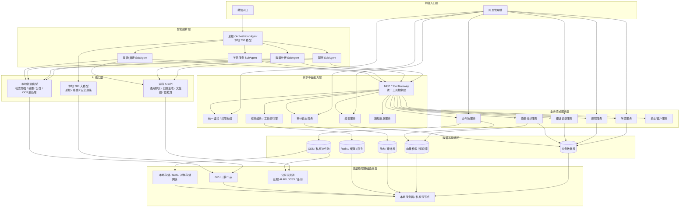

# Agent-First ERP — 教培智能体优先 ERP

> 以 AI Agent 为核心交互层的教培行业企业资源管理系统

**Agent-First 不是在传统 ERP 上"加一个 AI 助手"，而是以智能体编排为中心，重新设计业务交互与数据流转方式。**

用户通过微信对话即可完成学员查询、跟进记录、数据分析、报表生成等操作——背后由 Orchestrator Agent 自动拆解意图、调度 SubAgent、经 MCP Tool Gateway 调用业务服务，全程无需手动操作后台界面。

---

## 为什么是 Agent-First

| 传统 ERP | Agent-First ERP |
|---------|----------------|
| 以表单/CRUD 为核心，用户需逐页操作 | 以自然语言为入口，Agent 自动编排执行 |
| 信息分散在各模块，需人工汇总 | Agent 跨服务聚合信息，主动生成洞察 |
| 功能堆叠导致界面复杂 | 对话即操作，复杂流程被 Agent 吸收 |
| AI 作为辅助功能（可有可无） | AI Agent 是主路径，Web 后台是管理补充 |

**两条路径并存：**

- **微信端（Agent 路径）**：学员/家长/销售 → 总控 Orchestrator Agent → SubAgent → MCP → 业务服务
- **Web 管理端（直接路径）**：运营/管理层 → 鉴权 → 业务服务（保留完整的后台管理能力）

---

## 系统架构



---

## 架构分层说明

### 第 1 层：前台入口层

| 入口 | 面向用户 | 交互方式 | 说明 |
|------|---------|---------|------|
| 微信入口 | 学员、家长、销售、教师 | 自然语言对话 | 走 Agent 编排路径，是系统的**主交互通道** |
| 网页管理端 | 运营、管理层、财务 | 传统 Web 界面 | 直连业务服务，提供完整的数据管理与配置能力 |

**设计决策**：微信端不做"简化版后台"，而是一个完全不同的交互范式——对话驱动、意图识别、自动执行。Web 端保留是因为批量数据操作、系统配置、权限管理等场景仍需结构化界面。

### 第 2 层：智能编排层

系统的大脑。总控 Orchestrator Agent 基于本地 70B 大模型运行，负责：

- **意图识别与路由**：理解用户自然语言，判断应分发给哪个 SubAgent
- **安全决策**：敏感操作（删除数据、导出报表）需要二次确认或拒绝
- **多步编排**：复杂任务拆解为多个 SubAgent 协作完成

| SubAgent | 职责 | 典型场景 |
|----------|------|---------|
| 聊天 SubAgent | 通用对话、FAQ、知识问答 | "这个月有什么课程优惠？" |
| 数据分析 SubAgent | 数据查询、统计分析、趋势洞察 | "上季度续费率是多少？对比去年呢？" |
| 学员服务 SubAgent | 学员信息查询、跟进记录、课程操作 | "帮我查一下张三的上课记录" |
| 报表/摘要 SubAgent | 报表生成、数据摘要、周报月报 | "生成本周招生转化漏斗报告" |

### 第 3 层：共享中台能力层

所有 Agent 和 Web 端共享的横切能力：

| 组件 | 职责 |
|------|------|
| **MCP / Tool Gateway** | Agent 调用业务服务的**唯一通道**。将业务能力抽象为标准化 Tool（函数），Agent 通过 MCP 协议声明式调用，无需了解底层服务实现 |
| **统一鉴权** | JWT + RBAC 权限模型，Agent 调用和 Web 调用走同一套鉴权链路 |
| **工作流引擎** | 多步业务流程编排（如：招生线索 → 跟进 → 试听 → 签约），支持人工审批节点 |
| **报表服务** | 统一的报表生成与导出能力 |
| **审计日志** | 全链路操作审计，Agent 的每次工具调用都有据可查 |
| **通知消息** | 微信模板消息、短信、站内信统一出口 |

**关键设计：MCP Tool Gateway**

MCP（Model Context Protocol）是 Agent 与业务服务之间的解耦层。它的价值在于：

1. **Agent 不直接调 API**：Agent 只需声明"我要调用 `query_student` 工具"，MCP 负责路由到学员服务
2. **工具可发现**：Agent 启动时自动获取可用工具列表及参数定义，无需硬编码
3. **统一鉴权与审计**：所有工具调用经过 MCP 网关，自动附加权限检查和操作日志
4. **业务迭代不影响 Agent**：新增/修改业务服务只需更新 MCP 工具定义，Agent 层无需改动

### 第 4 层：业务领域服务层

按 DDD（领域驱动设计）划分的核心业务模块：

| 服务 | 职责边界 | 核心实体 |
|------|---------|---------|
| 学员服务 | 学员档案、报名信息、学习记录 | Student, Enrollment |
| 课程服务 | 课程管理、排课、班级 | Course, Class, Schedule |
| 跟进记录服务 | 销售跟进、沟通记录、待办提醒 | FollowUp, Task |
| 画像分析服务 | 学员/客户画像、行为标签、流失预警 | Profile, Tag, Alert |
| 文件池服务 | 教学资料、合同、图片的存储与检索 | File, Document |
| 招生/客户服务 | 线索管理、转化漏斗、渠道分析 | Lead, Channel, Conversion |

**注意**：画像分析服务同时连接业务数据库（结构化数据）和向量数据库（非结构化特征向量），是 AI 能力与业务数据的交汇点。文件池服务同时连接 OSS（文件存储）和向量数据库（文档向量化检索）。

### 第 5 层：数据与存储层

| 存储 | 用途 | 推荐选型 |
|------|------|---------|
| 业务数据库 | 结构化业务数据 | PostgreSQL |
| OSS / 私有文件池 | 教学资料、合同、图片视频 | MinIO（本地）/ 阿里云 OSS（备份） |
| 向量检索 / 知识库 | 文档语义检索、学员特征向量 | Milvus |
| 日志 / 审计库 | 操作日志、Agent 调用链路 | Elasticsearch |
| Redis / 缓存 / 队列 | 热数据缓存、任务队列、会话状态 | Redis |

### 第 6 层：AI 能力层

三级模型分层，兼顾隐私、成本和能力：

| 层级 | 部署位置 | 模型规模 | 职责 | 推荐模型 |
|------|---------|---------|------|---------|
| **决策层** | 本地 GPU | 70B 参数 | 总控路由、意图识别、安全审查 | Qwen-2.5-72B / LLaMA-3-70B |
| **执行层** | 本地 GPU | 7B-14B 参数 | RAG 检索增强、文本摘要、分类、OCR 后处理 | Qwen-2.5-7B / ChatGLM-4 |
| **增强层** | 远程 API | 不限 | 复杂推理、创意生成、文生图 | DeepSeek-R1 / GPT-4 / Claude |

**设计原则**：

- **本地优先**：学员数据、跟进记录等敏感信息只经过本地模型处理，不出内网
- **远程补充**：仅在需要强推理或创意生成时调用远程 API，且不传递可识别个人信息
- **成本优化**：高频简单任务用本地小模型（近乎零成本），低频复杂任务才调远程 API

### 第 7 层：底层物理基础设施层

| 资源 | 用途 | 说明 |
|------|------|------|
| 本地服务器 / 私有云 | 数据库、缓存、向量库、日志 | 所有持久化数据**必须**存储在本地 |
| NAS / 对象存储网关 | 文件存储 | 教学资料本地存储，可选同步到云端备份 |
| GPU 计算节点 | AI 模型推理 | 至少需要 1 张 A100/H100 级显卡运行 70B 模型 |
| 公有云资源 | 远程 AI API、OSS 备份 | 仅用于非敏感数据的云端服务 |

---

## 技术栈

### 前端

| 技术 | 版本 | 用途 |
|------|------|------|
| React | 18+ | UI 框架 |
| TypeScript | 5+ | 类型安全 |
| Vite | 5+ | 构建工具 |
| Ant Design Pro | 6+ | 企业级中后台 UI |
| React Query | 5+ | 服务端状态管理 |
| ECharts | 5+ | 数据可视化 |
| Socket.io | 4+ | Agent 对话实时推送 |

### 后端

| 技术 | 版本 | 用途 |
|------|------|------|
| Python | 3.11+ | AI 集成、数据处理类服务 |
| FastAPI | 0.104+ | Python Web 框架 |
| Java | 17+ | 核心业务类服务 |
| Spring Boot | 3.2+ | Java 微服务框架 |
| Kong | 3+ | API 网关 |

### AI / Agent

| 技术 | 用途 |
|------|------|
| LangChain / LlamaIndex | LLM 应用框架、RAG 管道 |
| MCP SDK | Agent ↔ Tool 通信协议 |
| vLLM / Ollama | 本地模型推理引擎 |
| Hugging Face Transformers | 模型加载与微调 |
| PyTorch | 深度学习框架 |

### 数据与基础设施

| 技术 | 用途 |
|------|------|
| PostgreSQL | 业务主库 |
| Redis | 缓存 / 消息队列 / 会话 |
| Milvus | 向量数据库 |
| MinIO | 对象存储（本地部署） |
| Elasticsearch | 日志与审计 |
| Docker + Kubernetes | 容器编排 |
| Nginx | 反向代理 / 负载均衡 |

---

## 项目目录结构

```
agent-first-erp/
│
├── web/                          # Web 前端（React + Ant Design Pro）
│   ├── src/
│   │   ├── pages/                # 页面组件
│   │   ├── components/           # 通用组件
│   │   ├── services/             # API 调用
│   │   ├── stores/               # 状态管理
│   │   └── utils/                # 工具函数
│   └── package.json
│
├── services/                     # 后端微服务
│   ├── gateway/                  # API 网关（Kong 配置）
│   ├── auth/                     # 统一鉴权服务
│   ├── student/                  # 学员服务
│   ├── course/                   # 课程服务
│   ├── follow-up/                # 跟进记录服务
│   ├── profile/                  # 画像分析服务
│   ├── file-pool/                # 文件池服务
│   ├── crm/                      # 招生/客户服务
│   ├── report/                   # 报表服务
│   ├── audit/                    # 审计日志服务
│   └── notification/             # 通知消息服务
│
├── agent/                        # AI Agent 编排层
│   ├── orchestrator/             # 总控 Orchestrator Agent
│   ├── sub-agents/               # SubAgent 实现
│   │   ├── chat/                 # 聊天 SubAgent
│   │   ├── analytics/            # 数据分析 SubAgent
│   │   ├── student-service/      # 学员服务 SubAgent
│   │   └── report/               # 报表/摘要 SubAgent
│   └── mcp-tools/                # MCP Tool 定义与注册
│
├── ai/                           # AI 模型服务
│   ├── model-server/             # 模型推理服务（vLLM/Ollama）
│   ├── rag/                      # RAG 检索增强管道
│   └── fine-tune/                # 模型微调脚本
│
├── infra/                        # 基础设施配置
│   ├── docker/                   # Dockerfile 集合
│   ├── k8s/                      # Kubernetes 部署清单
│   ├── nginx/                    # Nginx 配置
│   └── scripts/                  # 部署与运维脚本
│
├── docs/                         # 项目文档
│   ├── architecture/             # 架构设计文档
│   ├── api/                      # API 接口文档
│   └── guides/                   # 开发指南
│
├── docker-compose.yml            # 本地开发环境编排
├── .env.example                  # 环境变量模板
└── README.md                     # 本文件
```

---

## 开发路线图

### P0 — 基础骨架

建立项目基础设施和核心 CRUD 能力。

- [ ] 项目脚手架搭建（monorepo 结构、CI/CD）
- [ ] 统一鉴权服务（JWT + RBAC）
- [ ] 学员服务（CRUD + 搜索）
- [ ] 课程服务（CRUD + 排课）
- [ ] Web 管理端（基于 Ant Design Pro 的管理后台）
- [ ] PostgreSQL + Redis 基础数据层
- [ ] Docker Compose 本地开发环境

### P1 — Agent 核心

建立 Agent-First 的核心交互链路。

- [ ] MCP Tool Gateway（工具注册、调用路由、鉴权集成）
- [ ] 总控 Orchestrator Agent（本地 70B 模型 + 意图路由）
- [ ] 聊天 SubAgent + 学员服务 SubAgent
- [ ] 微信公众号/小程序接入
- [ ] Agent 对话会话管理
- [ ] 审计日志服务（Agent 调用链路追踪）

### P2 — 业务深化

补全业务模块，丰富 Agent 能力。

- [ ] 跟进记录服务 + CRM/招生服务
- [ ] 画像分析服务（标签体系 + 向量特征 + 流失预警）
- [ ] 文件池服务（MinIO + 文档向量化）
- [ ] 报表服务 + 报表/摘要 SubAgent
- [ ] 数据分析 SubAgent
- [ ] 通知消息服务（微信模板消息 + 站内信）
- [ ] 工作流引擎（招生转化流程、审批流程）

### P3 — AI 增强

深化 AI 能力，优化体验。

- [ ] RAG 知识库（教学资料、FAQ、政策文档检索增强）
- [ ] 本地小模型部署（分类、摘要、OCR 后处理）
- [ ] 远程 AI API 集成（DeepSeek-R1 / GPT-4 按需调用）
- [ ] 学员画像智能分析（行为预测、课程推荐）
- [ ] Agent 多轮对话优化与记忆管理
- [ ] 模型微调（教培领域适配）

---

## 部署架构

```
┌─────────────────────────────────────────────────────┐
│                   本地机房 / 私有云                      │
│                                                     │
│  ┌───────────┐  ┌───────────┐  ┌───────────┐       │
│  │ Web 前端   │  │ API 网关   │  │ 微信接入   │       │
│  │ (Nginx)   │  │ (Kong)    │  │           │       │
│  └─────┬─────┘  └─────┬─────┘  └─────┬─────┘       │
│        └───────────────┼──────────────┘             │
│                        ▼                            │
│  ┌─────────────────────────────────────────────┐    │
│  │          Kubernetes 集群                      │    │
│  │  ┌──────┐ ┌──────┐ ┌──────┐ ┌──────┐       │    │
│  │  │ 鉴权  │ │ 学员  │ │ 课程  │ │ CRM  │ ...  │    │
│  │  └──────┘ └──────┘ └──────┘ └──────┘       │    │
│  │  ┌──────────┐ ┌────────────────┐            │    │
│  │  │MCP Gateway│ │ Agent 编排服务  │            │    │
│  │  └──────────┘ └────────────────┘            │    │
│  └─────────────────────────────────────────────┘    │
│                                                     │
│  ┌──────────┐ ┌──────┐ ┌───────┐ ┌──────┐         │
│  │PostgreSQL│ │Redis │ │Milvus │ │MinIO │         │
│  └──────────┘ └──────┘ └───────┘ └──────┘         │
│                                                     │
│  ┌─────────────────────────────────────────────┐    │
│  │           GPU 节点                            │    │
│  │  ┌────────────────┐ ┌────────────────┐      │    │
│  │  │ 70B 模型 (vLLM) │ │ 小模型 (Ollama) │      │    │
│  │  └────────────────┘ └────────────────┘      │    │
│  └─────────────────────────────────────────────┘    │
└─────────────────────────────────────────────────────┘
              │                          │
              │ OSS 备份同步              │ 远程 AI API 调用
              ▼                          ▼
┌──────────────────┐        ┌──────────────────┐
│   公有云 OSS      │        │  DeepSeek / GPT  │
│   (灾备 / CDN)    │        │  (按需调用)       │
└──────────────────┘        └──────────────────┘
```

**本地优先原则**：所有业务数据、学员信息、操作日志都存储在本地机房，不依赖公有云。公有云仅用于远程 AI API 的按需调用和文件备份。这确保了数据主权可控、网络中断时系统仍可运行核心功能。

---

## License

MIT
