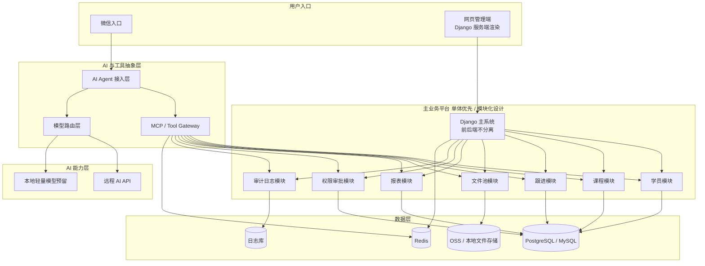

# Agent-First ERP · 教育企业智能学员信息平台

> 面向教育企业内部员工的智能学员信息平台。<br/>
> 员工通过 **微信** 或 **网页后台** 获取和更新学员信息；<br/>
> AI Agent 通过 **MCP / Tool Gateway** 调用共享业务能力；<br/>
> 系统采用 **Django 单体模块化架构**，强调 **业务解耦、低预算起步、可分块上线、可逐步扩展本地 AI 能力**。

---

## 1. 项目概述

Agent-First ERP 不是传统意义上的“后台系统 + AI 助手”，而是一套以 **业务底座稳定运行** 为前提、以 **AI Agent 自然语言交互** 为增强能力的教育企业内部平台。

系统的目标不是一开始就构建复杂的 AI 基础设施，而是先解决教育企业在日常运营中的高频问题：

- 学员信息查询成本高
- 跟进记录分散、难以汇总
- 微信场景下操作不方便
- 报表和摘要依赖人工整理
- AI 接入容易直接侵入业务系统，造成权限与审计风险

因此，本项目规划为以下几层协同工作：

- **微信入口**：员工高频查询和轻量更新入口
- **网页后台**：管理员配置、管理、报表、审计入口
- **AI Agent 层**：自然语言交互与任务编排
- **MCP / Tool Gateway**：统一业务能力抽象层
- **Django 主系统**：前后端不分离的核心业务平台
- **数据库 / 文件池**：企业数据底座
- **远程 AI API + 本地 AI 预留**：低预算启动，后续平滑升级

### 核心目标

1. 降低员工使用门槛，不依赖复杂后台操作
2. 让查询、更新、摘要、报表更自然、更高效
3. 保证 AI 与业务数据解耦，避免模型直连数据库
4. 用模块化单体方式低成本上线，并支持未来拆分与扩容

---

## 2. 设计原则

### 2.1 业务解耦

- 微信入口与网页入口解耦
- AI Agent 与业务系统解耦
- 业务能力通过 MCP / Tool Gateway 暴露
- 学员、课程、跟进、文件、报表、权限、审计按模块拆分

### 2.2 前后端不分离

- 主系统采用 Django 单体架构
- 后台页面由 Django 服务端渲染
- 避免单独维护前端 SPA 工程，降低初期复杂度

### 2.3 低预算优先

- 第一阶段不强依赖本地大模型
- AI 能力优先接入远程 AI API
- 本地服务器以业务系统稳定运行为优先
- 预留本地轻量模型、向量库、GPU 节点扩展位

### 2.4 可分块上线

- 先上核心业务模块
- 后上文件池、报表、审计
- 再上知识检索、画像分析、本地模型

### 2.5 安全与审计

- AI 不直接操作数据库
- 所有业务操作通过 Django 模块 / Tool Gateway 完成
- 敏感操作必须可审计
- 高风险更新可接入审批流

---

## 3. 当前目标形态

### 3.1 用户入口

#### 微信入口

用于：

- 查询学员信息
- 查询课程、报名、出勤、跟进情况
- 更新轻量跟进记录
- 获取 AI 总结、建议、摘要

#### 网页后台

用于：

- 学员信息管理
- 跟进记录管理
- 文件池管理
- 报表查看
- 角色权限管理
- 审计日志查看
- Agent / Prompt / Tool 配置

### 3.2 核心架构组件

- **Django 主系统**：业务核心平台，前后端不分离
- **MCP / Tool Gateway**：统一抽象业务能力
- **AI Agent 接入层**：接收微信消息，完成自然语言交互
- **PostgreSQL / MySQL**：业务主数据库
- **Redis**：缓存、队列、会话辅助
- **OSS / 本地文件池**：文件存储
- **远程 AI API**：初期主要模型能力来源
- **本地轻量 AI 预留**：未来可接摘要、分类、RAG

---

## 4. 总体架构



---

## 5. 模块划分

项目采用 Django 单体模块化设计，建议按 app 拆分。

### 5.1 accounts

负责：

- 用户
- 角色
- 部门
- 登录认证
- 权限控制

### 5.2 students

负责：

- 学员基础信息
- 家长信息
- 学员状态
- 标签关系

### 5.3 courses

负责：

- 课程信息
- 报名信息
- 班级归属
- 出勤记录

### 5.4 followups

负责：

- 跟进记录
- 跟进计划
- 跟进结果
- 下次跟进提醒

### 5.5 files

负责：

- 文件元数据
- 学员关联附件
- 文件分类
- 文件权限
- OSS / 本地存储适配

### 5.6 reports

负责：

- 数据统计
- 可视化报表
- 周报 / 月报生成
- 运营分析接口

### 5.7 agents

负责：

- AI Agent 配置
- Prompt 模板
- Tool 配置
- 模型路由配置

### 5.8 audits

负责：

- 操作日志
- 审计日志
- Agent 调用日志
- 数据访问日志

### 5.9 core

负责：

- 公共基类
- 通用工具
- 配置封装
- 中间件
- 错误处理

---

## 6. 业务边界约束

### 6.1 AI Agent 不允许

- 直接连接数据库
- 绕过权限系统
- 直接写业务表
- 绕过审计机制

### 6.2 所有 AI 调用业务数据必须经过

- MCP / Tool Gateway
- Django 业务模块服务层
- 权限校验
- 审计日志记录

### 6.3 高风险操作建议

以下操作建议接入审计与审批：

- 批量更新学员状态
- 批量导出学员数据
- 修改敏感字段
- 跨部门读取数据

---

## 7. 第一阶段范围（MVP）

### 7.1 核心功能

- 学员信息管理
- 跟进记录管理
- 微信查询学员信息
- 微信查询跟进历史
- 轻量 AI 摘要与建议
- 基础权限管理
- 基础审计日志

### 7.2 暂不优先

- 本地 70B 模型
- 多 Agent Team
- 复杂向量检索
- 高级画像系统
- 完整审批流
- 重型前端 SPA

---

## 8. 分阶段施工进度

### 阶段 0：项目初始化

**目标**：建立统一仓库、基础文档、开发规范、目录结构。

**状态**：

- [ ] 初始化 Git 仓库
- [ ] 建立 Django 项目骨架
- [ ] 建立基础 README
- [ ] 明确模块边界
- [ ] 明确环境变量规范
- [ ] 建立 issue / milestone 规则

**交付物**：

- 项目目录结构
- README.md
- 初始 settings
- requirements / pyproject
- `.env.example`

### 阶段 1：业务主系统 MVP

**目标**：先让网页后台和核心业务数据跑起来。

**状态**：

- [ ] accounts 模块
  - [ ] 用户模型
  - [ ] 角色模型
  - [ ] 部门模型
  - [ ] 登录认证
  - [ ] 基础 RBAC
- [ ] students 模块
  - [ ] 学员基础信息
  - [ ] 标签关系
  - [ ] 学员列表 / 详情页
- [ ] courses 模块
  - [ ] 课程
  - [ ] 报名
  - [ ] 出勤
- [ ] followups 模块
  - [ ] 跟进记录
  - [ ] 跟进记录列表 / 新增 / 编辑
- [ ] audits 模块
  - [ ] 操作日志
  - [ ] 重要动作审计
- [ ] Django 后台页面基础框架
  - [ ] 首页
  - [ ] 学员管理页
  - [ ] 跟进管理页
  - [ ] 登录页

**交付物**：

- 网页后台可登录
- 学员信息可录入 / 查询 / 编辑
- 跟进记录可维护
- 基础权限可用
- 审计日志基础版可用

### 阶段 2：AI 接入 MVP

**目标**：接入微信 + AI Agent，实现自然语言查询。

**状态**：

- [ ] AI Agent 接入层
  - [ ] webhook 入口预留
  - [ ] 对话请求接收
  - [ ] 会话上下文管理
- [ ] MCP / Tool Gateway
  - [ ] 查询学员信息工具
  - [ ] 查询课程信息工具
  - [ ] 查询跟进记录工具
  - [ ] 写入轻量跟进工具
- [ ] 模型路由层
  - [ ] 接远程 AI API
  - [ ] 模型配置
  - [ ] 错误重试与降级
- [ ] 基础安全
  - [ ] 工具调用鉴权
  - [ ] Agent 调用日志

**交付物**：

- 微信可查学员基础信息
- 微信可查跟进历史
- 微信可生成学员摘要
- MCP 工具层可用
- AI 不直连数据库

### 阶段 3：文件池与报表

**目标**：让系统具备资料管理和基础分析能力。

**状态**：

- [ ] files 模块
  - [ ] 文件元数据
  - [ ] 文件上传
  - [ ] 文件分类
  - [ ] 文件关联学员
- [ ] reports 模块
  - [ ] 学员统计
  - [ ] 跟进统计
  - [ ] 课程 / 出勤分析
  - [ ] 基础可视化
- [ ] 审计增强
  - [ ] 文件访问日志
  - [ ] 报表导出日志

**交付物**：

- 文件池可用
- 基础报表可用
- 文件访问可审计

### 阶段 4：可扩展 AI 能力

**目标**：为后续本地模型、知识库和画像分析打基础。

**状态**：

- [ ] 本地轻量模型接入预留
- [ ] 向量检索接口预留
- [ ] 学员画像摘要模型预留
- [ ] Prompt 配置页
- [ ] Agent 配置页
- [ ] 多模型切换能力

**交付物**：

- AI 能力配置化
- 本地模型可插拔
- RAG / 画像系统可接入

### 阶段 5：后续增强（非当前优先）

**规划项**：

- [ ] 本地轻量模型正式部署
- [ ] 70B 总控模型评估
- [ ] 向量知识库上线
- [ ] 画像分析服务
- [ ] 审批流
- [ ] 多 Agent Team
- [ ] 本地 GPU 节点扩展
- [ ] 混合云部署

---

## 9. 当前技术决策

### 已确定

- 主框架：Django
- 架构方式：前后端不分离
- 业务架构：单体模块化
- AI 接入：Agent + MCP Tool Gateway
- 数据库：PostgreSQL（优先）/ MySQL
- 缓存：Redis
- 文件存储：OSS 或本地文件存储
- 模型策略：初期远程 AI API，后续预留本地模型

### 暂不确定 / 待评估

- 企业微信正式接入方式
- 远程模型供应商
- 文件池最终落 OSS 还是本地对象存储
- 是否引入 Celery
- 是否在第二阶段引入 pgvector
- 本地轻量模型选型
- 本地 GPU 节点采购时机

---

## 10. Codex / AI 开发协作指引

如果你是 Codex 或其他 AI 编码助手，请优先理解以下约束：

### 10.1 必须遵守

1. 项目是 **Django 单体模块化**
2. **前后端不分离**
3. 页面优先使用 Django 模板体系实现
4. AI Agent 不允许直接读写数据库
5. 所有业务能力必须通过 Django 模块服务层或 Tool Gateway 访问
6. 代码必须便于未来拆模块和独立部署
7. 所有敏感更新操作必须可审计

### 10.2 优先产出顺序

1. Django 项目目录结构
2. settings 拆分
3. accounts / students / followups 模块
4. 基础页面模板
5. MCP Tool Gateway 骨架
6. AI Agent 接入层骨架
7. files / reports / audits 模块

### 10.3 不要优先做的事

- 不要一开始构建复杂微服务
- 不要先写前后端分离 SPA
- 不要先接入重型本地大模型
- 不要让 Agent 直接连接业务数据库
- 不要忽略审计与权限边界

---

## 11. 推荐目录结构

```text
project-root/
├─ README.md
├─ .env.example
├─ requirements/
│  ├─ base.txt
│  ├─ dev.txt
│  └─ prod.txt
├─ manage.py
├─ config/
│  ├─ __init__.py
│  ├─ settings/
│  │  ├─ __init__.py
│  │  ├─ base.py
│  │  ├─ dev.py
│  │  └─ prod.py
│  ├─ urls.py
│  ├─ wsgi.py
│  └─ asgi.py
├─ apps/
│  ├─ core/
│  ├─ accounts/
│  ├─ students/
│  ├─ courses/
│  ├─ followups/
│  ├─ files/
│  ├─ reports/
│  ├─ agents/
│  └─ audits/
├─ templates/
│  ├─ base/
│  ├─ accounts/
│  ├─ students/
│  ├─ followups/
│  ├─ files/
│  └─ reports/
├─ static/
│  ├─ css/
│  ├─ js/
│  └─ img/
├─ media/
├─ logs/
├─ scripts/
├─ docs/
└─ tests/
```

---

## 12. 最近优先任务清单

### P0

- [ ] 初始化 Django 项目
- [ ] 完成基础 settings
- [ ] 完成 accounts 模块
- [ ] 完成 students 模块
- [ ] 完成 followups 模块
- [ ] 完成后台基础 layout
- [ ] 完成审计日志基础版

### P1

- [ ] MCP 工具层骨架
- [ ] AI Agent 请求入口
- [ ] 微信回调预留
- [ ] 学员查询工具
- [ ] 跟进记录查询工具
- [ ] 跟进记录轻量写入工具

### P2

- [ ] 文件池模块
- [ ] 报表模块
- [ ] Prompt / Agent 配置页
- [ ] 远程模型配置
- [ ] 调用日志看板

### P3

- [ ] 向量检索预留
- [ ] 本地轻量模型预留
- [ ] 画像摘要服务预留

---

## 13. 里程碑定义

### Milestone 1：业务主系统可用

完成标准：

- 网页后台可登录
- 学员可查可改
- 跟进记录可维护
- 权限基础可用
- 审计基础可用

### Milestone 2：微信查询可用

完成标准：

- 微信可查学员信息
- 微信可查跟进历史
- AI 可生成基础摘要
- MCP 工具层可用

### Milestone 3：文件与报表可用

完成标准：

- 文件池可上传管理
- 报表可查看
- 文件访问与报表导出可审计

### Milestone 4：AI 配置化与扩展预留

完成标准：

- Agent / Prompt 可配置
- 模型路由可切换
- 本地模型接口预留完成
- RAG / 画像可扩展

---

## 14. 当前项目结论

本项目当前优先级不是“先做最强 AI”，而是：

1. 先做稳定的业务底座
2. 先保证网页后台可用
3. 先让微信查询跑通
4. 用 MCP 保证 AI 与业务解耦
5. 用模块化单体保证低预算快速上线
6. 为后续本地 AI、知识库、画像分析保留扩展空间

---

## 15. License

待定

---

## 16. Maintainers

待补充
